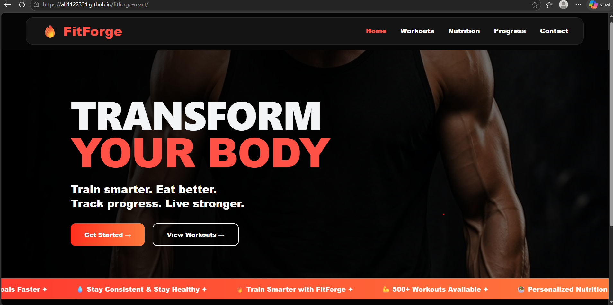
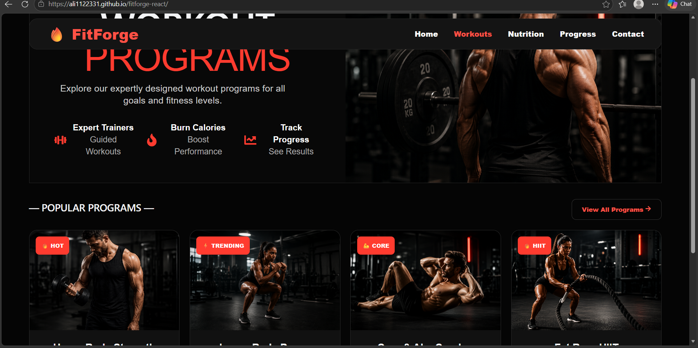
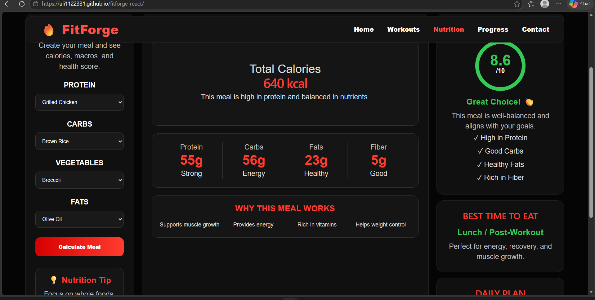
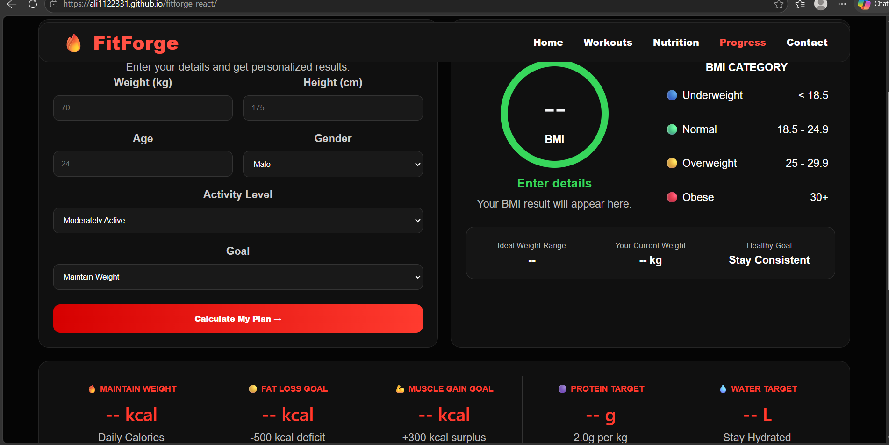
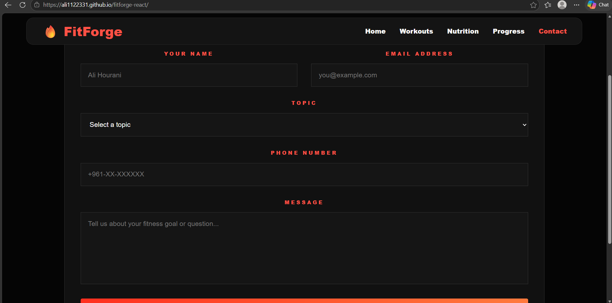

# 🔥 FitForge

FitForge is a modern fitness web application built with React and Vite. It helps users explore workout plans, nutrition tips, fitness progress tracking, and contact information in a clean and responsive interface.

## 🚀 Live Demo

https://ali1122331.github.io/fitforge-react/

## 📂 GitHub Repository

https://github.com/Ali1122331/fitforge-react

---

## ✨ Features

- Responsive fitness website
- Modern React component structure
- Workout recommendations
- Nutrition guidance
- Progress tracking section
- Contact page
- Deployed using GitHub Pages
- Clean and attractive UI

---

## 🛠️ Technologies Used

- React.js
- Vite
- JavaScript (ES6+)
- CSS3
- HTML5
- Git
- GitHub Pages

---

## 📁 Project Structure

```text
fitforge-2/
│
├── public/
├── screenshots/
├── src/
│   ├── assets/
│   ├── components/
│   │   ├── Contact.jsx
│   │   ├── Home.jsx
│   │   ├── Navbar.jsx
│   │   ├── Nutrition.jsx
│   │   ├── Progress.jsx
│   │   └── Workouts.jsx
│   │
│   ├── App.jsx
│   ├── App.css
│   ├── index.css
│   └── main.jsx
│
├── README.md
├── package.json
└── vite.config.js
```

---

## ⚙️ Installation

Clone the repository:

```bash
git clone https://github.com/Ali1122331/fitforge-react.git
```

Navigate to the project directory:

```bash
cd fitforge-react
```

Install dependencies:

```bash
npm install
```

Run the development server:

```bash
npm run dev
```

Open the local URL shown in the terminal.

---

## 📸 Screenshots

### Home Page



### Workouts Page



### Nutrition Page



### Progress Page



### Contact Page



---

## 🌐 Live Website

https://ali1122331.github.io/fitforge-react/

---

## 👨‍💻 Author

**Ali Hourani**

Computer Science Student

GitHub: https://github.com/Ali1122331

---

## 📄 License

This project was created for educational and learning purposes.